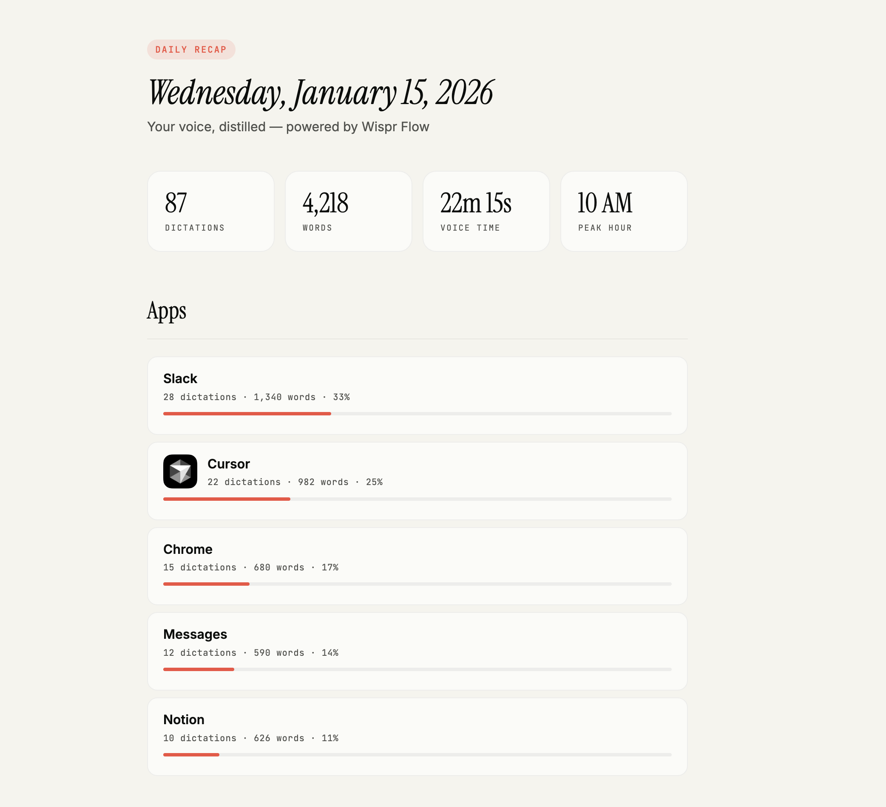
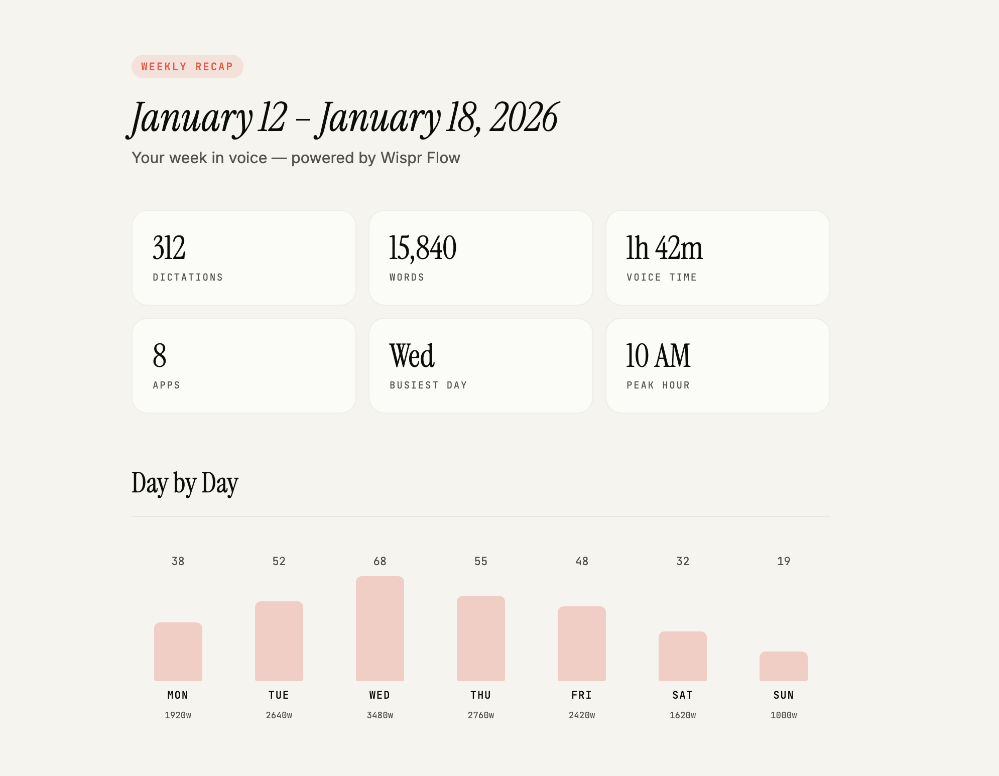
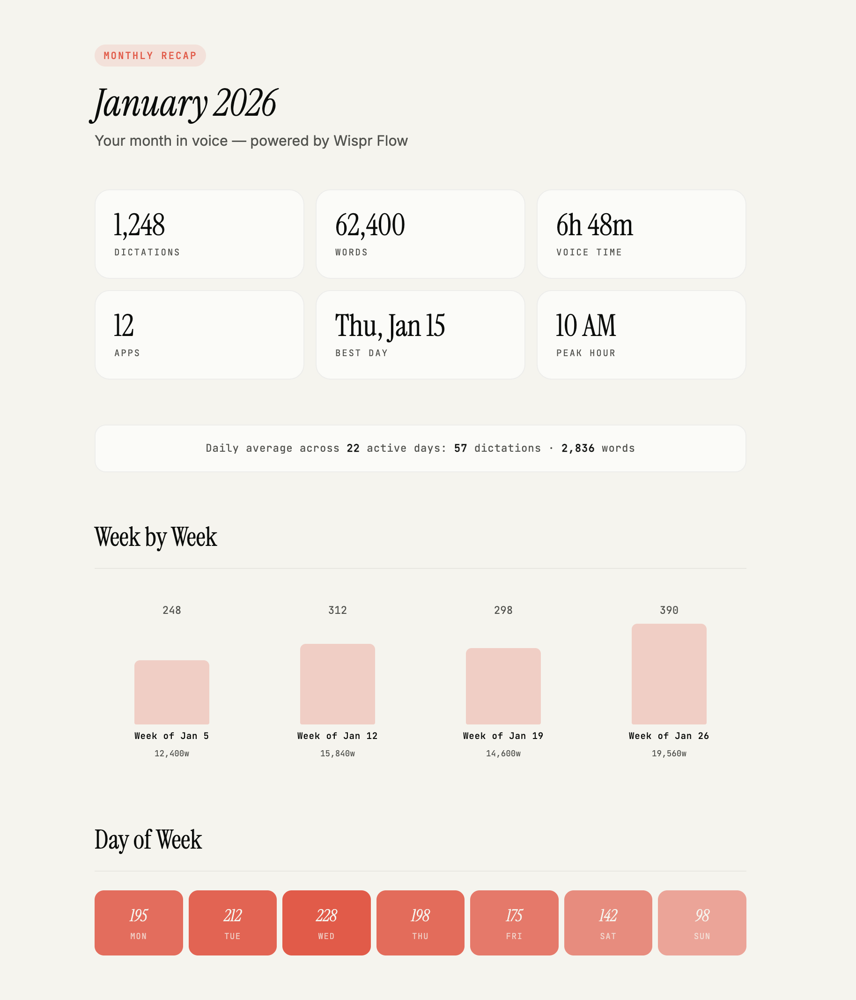

# Wispr Flow Recap

Beautiful activity recaps for [Wispr Flow](https://lttlmg.ht/wisprflow) voice dictation. See what you said, when you said it, and which apps you used — daily, weekly, or monthly.

Built as a [Claude Code](https://docs.anthropic.com/en/docs/claude-code) skill by [@cathrynlavery](https://x.com/cathrynlavery) at [founder.codes](https://founder.codes).

<!-- Add screenshots here -->
<!--  -->
<!--  -->
<!--  -->

## What it does

Reads the local Wispr Flow SQLite database and generates styled HTML recaps of your voice activity.

### Daily Recap
- Total dictations, words spoken, voice time, peak hour
- App breakdown with icons ranked by usage
- Hour-by-hour timeline with transcript snippets
- Topic summary grouped by app

### Weekly Recap
- Day-by-day bar chart of activity
- Hourly heatmap showing when you're most active
- App breakdown across the full week

### Monthly Recap
- Week-by-week bar chart
- Day-of-week heatmap (which weekdays are busiest)
- Hourly heatmap across the month
- App breakdown with monthly totals
- Daily average stats

All reports include a **Share** button that generates a 1200x630 branded card you can download or share directly to X.

## Design

Reports are styled with the [founder.codes](https://founder.codes) design language:

- Warm beige background (`#f5f4ed`)
- [Instrument Serif](https://fonts.google.com/specimen/Instrument+Serif) headings (italic)
- [Inter](https://fonts.google.com/specimen/Inter) body text
- [JetBrains Mono](https://fonts.google.com/specimen/JetBrains+Mono) labels and stats
- Coral accent (`#f34e3f`) for highlights and progress bars
- Charcoal (`#2d2d2d`) for chart bars and heatmaps

## Setup

Requires [Wispr Flow](https://lttlmg.ht/wisprflow) desktop app with local history enabled and Node.js 18+.

```bash
cd scripts
npm install
```

## Usage

### Daily

```bash
# CLI markdown output
node scripts/daily-recap.js

# HTML report (saves to Desktop)
node scripts/daily-recap.js --html

# Specific date
node scripts/daily-recap.js --html --date=2026-02-05
```

### Weekly

```bash
# Current week (Mon–Sun)
node scripts/weekly-recap.js --html

# Specific week
node scripts/weekly-recap.js --html --week-of=2026-01-27
```

### Monthly

```bash
# Current month
node scripts/monthly-recap.js --html

# Specific month
node scripts/monthly-recap.js --html --month=2026-01
```

## Claude Code Skill

This works as a Claude Code skill — just ask naturally:

> "What did I do today?"
> "Show me my weekly recap"
> "Generate a monthly report for January"

Copy `SKILL.md` to your Claude Code skills directory and the scripts will be invoked automatically.

## Examples

See the `examples/` folder for sample HTML reports with fictional data:

- [sample-daily.html](examples/sample-daily.html) — A day of coding and communication
- [sample-weekly.html](examples/sample-weekly.html) — Full week with heatmaps and charts
- [sample-monthly.html](examples/sample-monthly.html) — Month-long activity overview

## How it works

The scripts read from Wispr Flow's local SQLite database at:
```
~/Library/Application Support/Wispr Flow/flow.sqlite
```

The `History` table contains every dictation with timestamps, app bundle IDs, transcript text, and word counts. The scripts query this data, resolve bundle IDs to human-readable app names and icons, then generate either CLI markdown or styled HTML.

## License

MIT

---

Built by [@cathrynlavery](https://x.com/cathrynlavery) · [founder.codes](https://founder.codes) · Powered by [Wispr Flow](https://lttlmg.ht/wisprflow)
